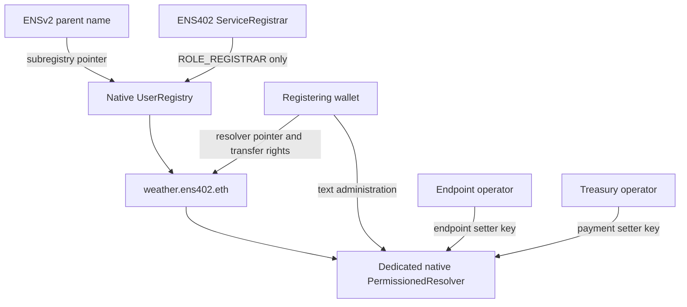

# ENS402 contracts

## Native ENS remains the permission system

`ServiceRegistrar` is onboarding glue. It is granted only `ROLE_REGISTRAR` on a dedicated native ENS UserRegistry. Its registration transaction deploys a native PermissionedResolver, publishes the three application records, grants native delegates, gives the registering wallet text administration, removes its own bootstrap privileges, then registers the name. Every step reverts together on failure.

## Exact native roles

| Contract | Grant | Purpose |
| --- | --- | --- |
| UserRegistry root | `ROLE_REGISTRAR = 1` to ServiceRegistrar | Issue available labels in this namespace |
| UserRegistry name | `ROLE_SET_RESOLVER = 1 << 24` and its admin to registering owner | Manage the name's resolver pointer |
| UserRegistry name | `ROLE_CAN_TRANSFER_ADMIN = (1 << 28) << 128` to owner | Permit native name transfer |
| PermissionedResolver root | `ROLE_SET_TEXT = 1 << 4` and its admin to owner | Administer service configuration |
| PermissionedResolver key resource | Native endpoint setter grant to endpoint operator | Change `agent-endpoint[x402]` |
| PermissionedResolver key resource | Native payment setter grant to Treasury | Change `ens402.payment` |

Current source `71a3b733` uses `setText(bytes name,...)`, `grantSetterRoles`, and `revokeRoles`. A key grant spans records within the resolver. Each service therefore gets a separate resolver. `SET_TEXT` is not a made-up ENS402 role. The earlier `48b3e2d` ABI is supported explicitly for compatibility tests.

## Registration constraints

- Sepolia only. Factory, registry implementation and resolver code versions are checked against supported deployments.
- Commit/reveal binds chain, registrar, owner, label, endpoint, recipient, delegates and secret. Reveal requires a 60-second wait and expires after one day.
- Labels are 3-32 lowercase ASCII letters, digits or hyphens; leading/trailing hyphens are rejected. This deliberately narrow label policy avoids onchain ENS normalization ambiguity.
- Endpoint must start with HTTPS and fit the size bound. Clients independently validate full URL syntax, DNS, actual HTTP 402 and payment settings.
- Endpoint and Treasury delegates must be nonzero and distinct. The recipient is a Base Sepolia USDC address.
- Registration is free except gas, with a fixed namespace expiry at deployment. No token custody, payment hook, custom RBAC, broad token approval or upgrade proxy is introduced by ENS402.
- Reentrancy is blocked across native ERC1155 receiver callbacks.

## Remaining authority

The owner retains broad text administration and pointer rights. Parent/root registry administrators may retain native override powers. This is not an emancipated or immutable namespace. Transfers of the native name do not automatically transfer the separate resolver's administrator or remove its delegates. ENS402 observes owner/pointer changes and requires renewed buyer approval. Ancestor expiry still stops resolution.

Revoking ServiceRegistrar's native registrar role stops future registrations. It does not alter existing records. Record revocation stops future edits, not already signed payments. Daily payment budgets are PostgreSQL rules, not these contracts.

## Deployment and validation

Run `pnpm ens:namespace:plan` after obtaining the testnet parent. It generates unsigned transactions and refuses to overwrite an existing child registry. Deployment needs the actual parent owner and Sepolia ETH. No public-network deployment has been performed by the tests.

`pnpm test:contracts` runs native forks, including atomic registration, per-key rights, bootstrap privilege removal, commitment tampering/delay/expiry/replay, namespace expiry, native registrar revocation and isolated resolvers. `pnpm test:ens:current` validates current SDK resolution and permission calldata. `pnpm test:anvil` additionally settles against actual Base Sepolia USDC bytecode in a second disposable fork.
