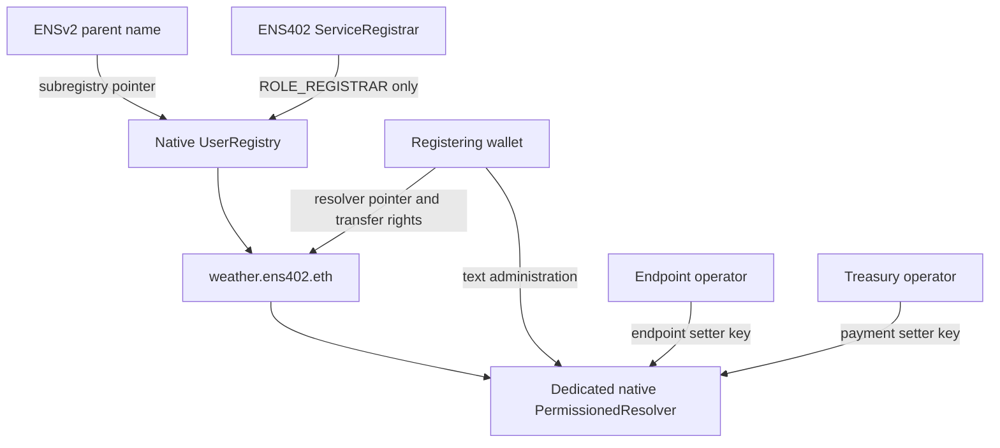

# ENS402 contracts

## Native ENS remains the permission system

`ServiceRegistrar` is onboarding glue. It is granted only `ROLE_REGISTRAR` on a dedicated native ENS UserRegistry. Its registration transaction deploys a native PermissionedResolver, publishes endpoint, schema-v2 payment, status, description and optional picture records, grants native delegates, gives the registering wallet text administration, removes its own bootstrap privileges, then registers the name. Every step reverts together on failure.

## Wallet, resource and role

Role and scope are separate. `ROLE_SET_TEXT = 16` is the same action for Ops and Admin, but root authority covers every text key. `ROLE_SET_TEXT_ADMIN = 16 << 128` administers those grants.

| Wallet | Contract / resource | Native roles | Effect |
| --- | --- | --- | --- |
| Ops | Dedicated resolver / separate `keccak256(key)` grants for endpoint, description and avatar | `ROLE_SET_TEXT` | Update the separately granted endpoint, description or picture key |
| Treasury writer | Dedicated resolver / `keccak256("ens402.payment")` | `ROLE_SET_TEXT` | Update payment record only |
| Service Admin | Dedicated resolver / root `0` | `ROLE_SET_TEXT`, `ROLE_SET_TEXT_ADMIN` | Write every text key, grant/revoke writers |
| Service Admin | UserRegistry / service name | `ROLE_SET_RESOLVER`, `ROLE_SET_RESOLVER_ADMIN`, `ROLE_CAN_TRANSFER_ADMIN` | Manage resolver pointer and native name transfer |
| Platform owner | Child UserRegistry / root `0` | `ROLE_REGISTRAR`, `ROLE_REGISTRAR_ADMIN` | Issue names and manage registrar grants |
| ServiceRegistrar | Child UserRegistry / root `0` | `ROLE_REGISTRAR` | Issue names only |

The service Admin is the wallet calling `register`. The platform owner controls the parent namespace; it is not automatically the service Admin. The USDC receiver is independent from the Treasury writer and gets no role simply by receiving funds.

Current native `grantSetterRoles(setText(...), wallet)` derives the resource and role. For text setters, the resource is the hash of the text key, not the full ENS name. Key grants therefore span records within a resolver: use one resolver per service. No fabricated Ops/Admin role exists in ENS. These are application labels for exact native grants.

This table is the intended registration configuration, not a live wallet audit. Other existing grants and parent/root powers can add authority.

## Implementation map

- `ServiceRegistrar.sol`: validate input, consume commitment, configure native resolver, publish name atomically.
- `libraries/ENSRoles.sol`: official role names and bitmaps.
- `libraries/ENSDeployment.sol`: current and legacy deployment compatibility pins. New setup scripts use current only.
- `interfaces/INativeENS.sol`: external ABI declarations; no permission implementation.
- `scripts/ens/README.md`: the two setup workflows, exact env inputs and transaction order.

Current source `71a3b733` uses `setText(bytes name,...)`, `grantSetterRoles` and `revokeRoles`. Legacy `48b3e2d` remains isolated compatibility coverage; it is not a second setup option.

## Registration constraints

- Sepolia only. Factory, registry implementation and resolver code versions are checked against supported deployments.
- Commit/reveal binds chain, registrar, owner, label, endpoint, recipient, delegates and secret. Reveal requires a 60-second wait and expires after one day.
- Labels are 3-32 lowercase ASCII letters, digits or hyphens; leading/trailing hyphens are rejected. This deliberately narrow label policy avoids onchain ENS normalization ambiguity.
- Endpoint must start with HTTPS and fit the size bound. Clients independently validate full URL syntax, DNS, actual HTTP 402 and payment settings.
- Endpoint and Treasury delegates must be nonzero and distinct. Ops must also differ from the service Admin. The recipient is a Base Sepolia USDC address.
- Registration is free except gas, with a fixed namespace expiry at deployment. No token custody, payment hook, custom RBAC, broad token approval or upgrade proxy is introduced by ENS402.
- Reentrancy is blocked across native ERC1155 receiver callbacks.

## Remaining authority

The owner retains broad text administration and pointer rights. Parent/root registry administrators may retain native override powers. This is not an emancipated or immutable namespace. Transfers of the native name do not automatically transfer the separate resolver's administrator or remove its delegates. ENS402 observes owner/pointer changes and requires renewed buyer approval. Ancestor expiry still stops resolution.

Revoking ServiceRegistrar's native registrar role stops future registrations. It does not alter existing records. Record revocation stops future edits, not already signed payments. Daily payment budgets are PostgreSQL rules, not these contracts.

## Deployment and validation

Run `pnpm ens:namespace:plan` after obtaining the testnet parent. It generates unsigned transactions and refuses to overwrite an existing child registry. Deployment needs the actual parent owner and Sepolia ETH. No public-network deployment has been performed by the tests.

`pnpm test:contracts` runs native forks, including atomic registration, per-key rights, bootstrap privilege removal, commitment tampering/delay/expiry/replay, namespace expiry, native registrar revocation and isolated resolvers. `pnpm test:ens:current` validates current SDK resolution and permission calldata. `pnpm test:anvil` additionally settles against actual Base Sepolia USDC bytecode in a second disposable fork.

## Paid subname service

The x402 purchase endpoint calls native UserRegistry.register directly from a dedicated worker with ROLE_REGISTRAR. It registers to the recipient with no resolver, avoiding a separate transfer and retained resolver administration. This path needs no ServiceRegistrar deployment. ServiceRegistrar remains useful for atomic full-service onboarding. See [AUDIT.md](AUDIT.md) for the full deployment inventory and recovery model.
