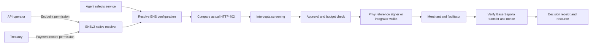

# ENS402

**Let agents find services. Verify where they pay.**

An agent resolves a merchant's current API through ENS, compares the HTTP 402 bill with public payment settings, screens the recipient, and asks its wallet to sign. Native ENSv2 EAC lets an operator update the API URL without permission to change the payment recipient.

## Components

- `apps/web`: shadcn/ui landing, architecture/pitch, fixture examples, authenticated operating console and server APIs.
- `packages/sdk`: pinned ENSv2 resolution and native transaction preparation, request checks, Intercepta adapter, provider-independent signing, real x402 v2 HTTP exchange and on-chain settlement verification.
- `packages/server`: Privy reference wallet provisioning, explicit approvals, PostgreSQL daily reservations and idempotent receipts, merchant/facilitator integration and reconciliation.
- `contracts`: interfaces and reproducible tests of actual native ENS registry/resolver proxies on a disposable Sepolia fork. No replacement permission contract.



## Run

Use Node 22+, pnpm, PostgreSQL CLI tools, and Foundry for fork tests. See [SETUP.md](SETUP.md) for exact environment, ENS and funding steps. Preserve existing `.env` and `.env.local`; never commit credentials.

```sh
pnpm install
pnpm db:local
pnpm db:migrate
pnpm setup:check
pnpm dev
```

`/architecture` is the sponsor walkthrough. `/console` runs real operations with a separate demo access token. Landing-page examples are labeled fixtures.

## Verify

```sh
pnpm test
pnpm test:integration
pnpm test:contracts
pnpm test:ens:fork
pnpm typecheck
pnpm build
pnpm test:intercepta:live
pnpm test:privy:live
```

Integration tests use real temporary PostgreSQL databases and simulated external providers. Fork tests execute native ENS contracts and actual SDK resolution, with fork-local registrations. Genuine Intercepta scanning has passed. Privy policy enforcement, live registered-name writes and funded payment settlement still require the setup in SETUP.md. See [IMPLEMENTATION.md](IMPLEMENTATION.md) for evidence and remaining gates.

## Integration and trust

`@ens402/sdk/ens` resolves supported registered names and prepares native record/grant transactions. `@ens402/sdk/http` obtains and checks the challenge, signs only after screening and a fresh ENS read, submits once, and verifies settlement through the caller's chain adapter. Lower-level `preparePayment` remains available for existing payment clients.

ENS enforces record writes. The SDK validates values and payment consistency. Ownership/resolver/version observations do not enumerate every admin grant or ancestor control path. Custom records `ens402.payment` and `ens402.status`, and the x402 value in `agent-endpoint[x402]`, are application conventions, not official ENS standards.

Privy is the default demo signer. Its policy is designed to restrict each authorization's chain, token, recipient, amount and expiry. Live enforcement needs credential-dependent tests. Daily totals are enforced by the reference backend database. The Privy app secret can change policies, so that backend remains trusted. Other integrators can supply their own wallet and policy infrastructure.

Intercepta returns address-risk evidence, not service quality. Its bounded one-hour cache never substitutes expired evidence after failure. Ethereum mainnet evidence is supplementary to Base Sepolia payments. World identity and ERC-8004 reputation remain future inputs and pitch context.

Vercel project `ens402` uses root `apps/web`. ENS uses Sepolia; payments use Base Sepolia only. Local research, decisions and validation receipts are under Git-ignored `docs/`.
