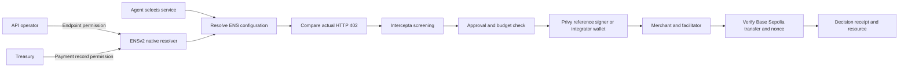

# ENS402

**Discover. Govern. Guard.**

ENS402 puts x402 service configuration on ENS, governs updates with native EAC, and verifies payment requests before agents sign.

An agent resolves a merchant's current API through ENS, compares the HTTP 402 bill with public payment settings, screens the recipient, and asks its wallet to sign. Native ENSv2 EAC lets an operator update the API URL without permission to change the payment recipient.

## Three connected layers

| Layer | Responsibility |
| --- | --- |
| ENS / Discovery | Public service configuration that independent indexers can use to reconstruct catalogs. |
| Native EAC / Governance | Scoped configuration updates: Ops maintains descriptions and endpoints, Treasury maintains payment terms, and Admin manages grants. |
| ENS402 SDK / Guard | Compare actual HTTP 402 requests with current ENS configuration and buyer approval before requesting a signature. |

Registration and management are the provider entry point. The Console is a reference application using the SDK through its backend; other applications can integrate the same core with their own signer.

Open indexing, description publishing and published fixed-price comparison remain planned. Existing payment checks do not imply these features are implemented. EAC controls ENS writes, while integrated clients detect conflicting HTTP responses. ENS resolution does not proxy traffic, and endpoint changes remain subject to buyer approval.

## Components

- `apps/web`: shadcn/ui landing, architecture/pitch, fixture examples, authenticated operating console and server APIs.
- `packages/sdk`: pinned ENSv2 resolution and native transaction preparation, request checks, Intercepta adapter, provider-independent signing, real x402 v2 HTTP exchange and on-chain settlement verification.
- `packages/server`: Privy reference wallet provisioning, explicit approvals, PostgreSQL daily reservations and idempotent receipts, merchant/facilitator integration and reconciliation.
- `contracts`: commit/reveal service registrar with dedicated native ENS resolvers and EAC delegation, plus reproducible Sepolia fork tests. See [CONTRACTS.md](CONTRACTS.md).



## Run

Use Node 22+, pnpm, PostgreSQL CLI tools, and Foundry for fork tests. See [SETUP.md](SETUP.md) for exact environment, ENS and funding steps. Preserve existing `.env` and `.env.local`; never commit credentials.

```sh
pnpm install
pnpm db:local
pnpm db:migrate
pnpm setup:check
pnpm dev
```

`/permissions` explains each wallet, resource and native role. [scripts/ens/README.md](scripts/ens/README.md) separates platform setup from service setup. `/architecture` is the sponsor walkthrough. `/console` supports Privy user login and scoped agent keys; `/operator` retains the admin-token workflow. `/docs` explains managed and self-signing integrations. `/register` enables native subdomain registration once the parent namespace is configured. Landing-page examples are labeled fixtures.

## Verify

```sh
pnpm test
pnpm test:integration
pnpm test:contracts
pnpm test:ens:fork
pnpm test:anvil
pnpm typecheck
pnpm build
pnpm test:intercepta:live
pnpm test:privy:live
```

Integration tests use real temporary PostgreSQL databases and simulated external providers. Fork tests execute native ENS contracts and actual SDK resolution, with fork-local registrations. Genuine Intercepta scanning has passed. Live Privy signing and seven policy-denial checks passed. Public registered-name writes, human login and funded public payment settlement still require [USER-TODO.md](USER-TODO.md). See [IMPLEMENTATION.md](IMPLEMENTATION.md) for evidence and remaining gates.

## Integration and trust

`@ens402/sdk/ens` resolves supported registered names and prepares native record/grant transactions. `@ens402/sdk/http` obtains and checks the challenge, signs only after screening and a fresh ENS read, submits once, and verifies settlement through the caller's chain adapter. Lower-level `preparePayment` remains available for existing payment clients.

ENS enforces record writes. The SDK validates values and payment consistency. Ownership/resolver/version observations do not enumerate every admin grant or ancestor control path. Custom records `ens402.payment` and `ens402.status`, and the x402 value in `agent-endpoint[x402]`, are application conventions, not official ENS standards.

Privy is the default demo signer. Its policy is designed to restrict each authorization's chain, token, recipient, amount and expiry. Live signing and policy-denial tests passed with the configured credentials. Daily totals are enforced by the reference backend database. The Privy app secret can change policies, so that backend remains trusted. Other integrators can supply their own wallet and policy infrastructure.

Intercepta returns address-risk evidence, not service quality. Its bounded one-hour cache never substitutes expired evidence after failure. Ethereum mainnet evidence is supplementary to Base Sepolia payments. World identity and ERC-8004 reputation remain future inputs and pitch context.

Vercel project `ens402` uses root `apps/web`. ENS uses Sepolia; payments use Base Sepolia only. Local research, decisions and validation receipts are under Git-ignored `docs/`.

For the presentation sequence and prerequisites, see [DEMO.md](DEMO.md).
